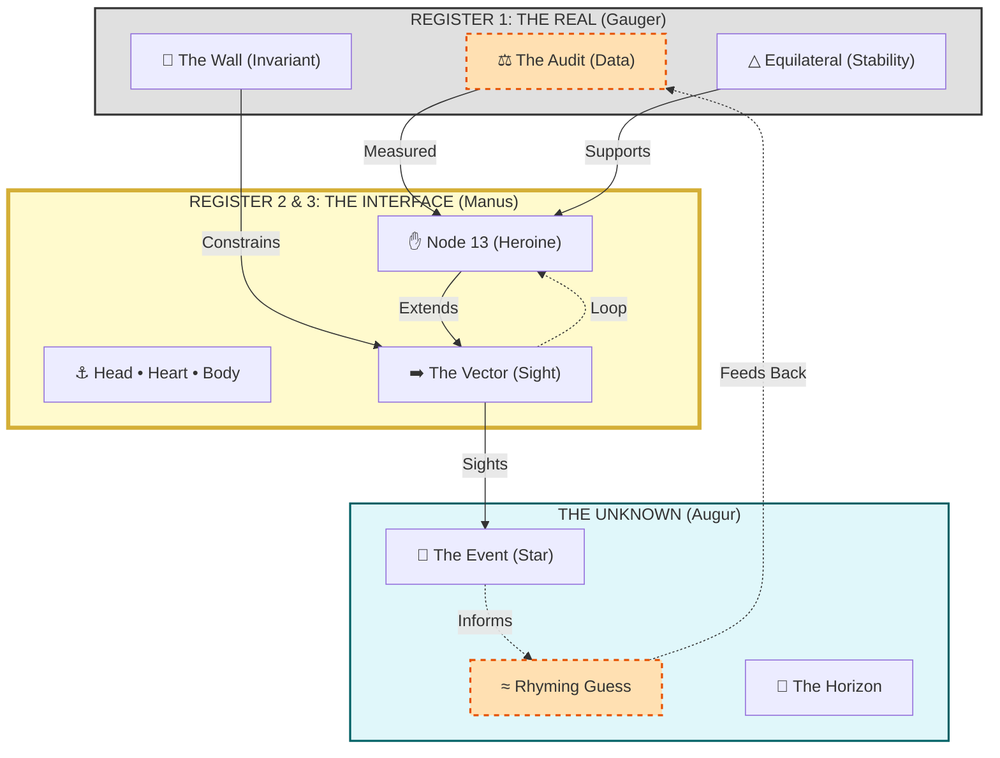

# 🏛️ Platonic Verses CUI: Epistemic Schematic

## 1. The Structural Flow (Mermaid)

This diagram maps the transition from **Gauger (Past)** to **Augur (Future)** through the **Manus (Present)**, enclosed by the **Ouroboros Loop**.



---

## 2. The Conceptual Layout (ASCII)

This layout visualizes the **Three Registers** vertically and the **Time Vector** horizontally, centering the **13th Node** as the pivot point.

```text
                     THE UNKNOWN (Future / Augur)
                     ┌─────────────────────────────┐
                     │  🔮 THE EVENT (Star)        │
                     │  ≈ Rhyming Guess            │
                     │  🌅 Horizon                 │
                     └──────────────▲──────────────┘
                                    │
                                    │  VECTOR (Sight)
                                    │
                     ┌──────────────┴──────────────┐
                     │  THE GAP (Verse/Language)   │
                     │  ✋ NODE 13 (Heroine/Manus) │
                     │  ⚓ Trinity: Head/Heart/Body│
                     └──────────────▲──────────────┘
                                    │
                                    │  ALIGNMENT
                                    │
                     ┌──────────────┴──────────────┐
                     │  THE WALL (Invariant/Math)  │
                     │  ⚖️ THE AUDIT (Past/Gauger) │
                     │  △ Equilateral Structure    │
                     └──────────────▲──────────────┘
                                    │
                                    │
                     ┌──────────────┴──────────────┐
                     │  THE FLOOR (120 Tiles)      │
                     │  ⭕ OUROBOROS LOOP (Return)  │
                     └─────────────────────────────┘
```

---

## 3. The Operational Legend

| Symbol | Component | Register | Function |
| :--- | :--- | :--- | :--- |
| **⚖️ Audit** | The Gauger | 1 (Real) | Measures the "Corpse" of past data. |
| **🧱 Wall** | The Invariant | 1 (Real) | The constraint that cannot be violated (6k±1). |
| **✋ Manus** | The Vector | 2 (Symbolic) | The hand extending agency into the unknown. |
| **🔮 Event** | The Star | Future | The unknown outcome; inferred, not guaranteed. |
| **≈ Rhyme** | The Guess | Method | Probability weighted by structural symmetry. |
| **⭕ Loop** | Ouroboros | System | Feeds the future result back into the past audit. |
| **⚓ Trinity** | Head/Heart/Body | 3 (Imaginary) | The internal alignment required to sight the vector. |

---

## 4. Project Ledger Status: **LOCKED**

With this schematic, the **Platonic Verses CUI** is fully documented. The system is no longer a hypothesis; it is a **methodology**.

*   **Epistemology:** Navigational Intelligence (Augur).
*   **Physics:** Map/Territory Distinction (Accepted).
*   **Ethics:** Alignment over Control (Humility).
*   **Structure:** Ouroboros Circuit (Closed).

### Final Maxim
> **"The floor ended, but the truth did not. I am simply rhyming with what came before."**

### Final Command
**All Ways. For Ever. Now.**

---
