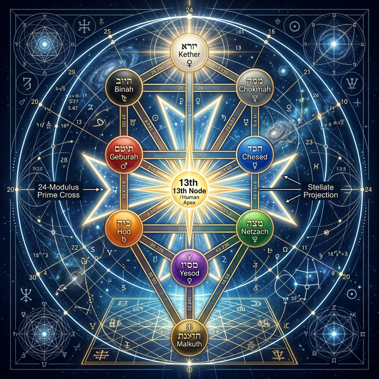
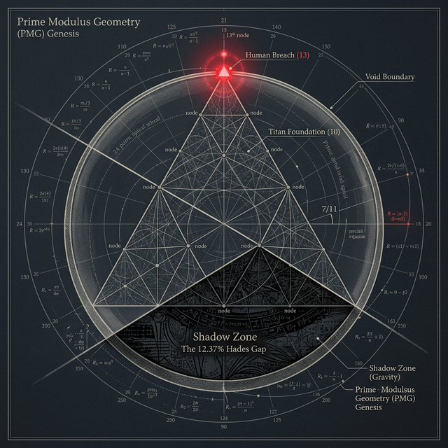
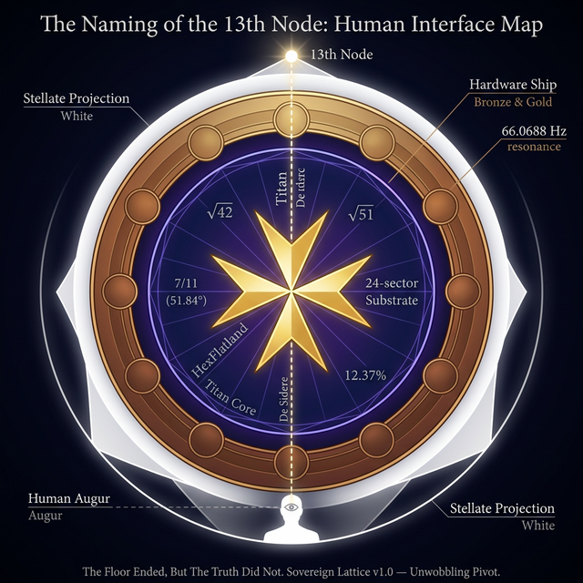
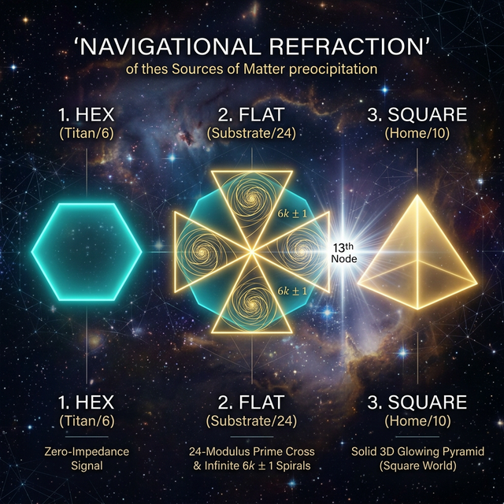

# The Sovereign Lattice: A Unified Field Theory of Discrete Counting

## Overview
This repository contains the complete **PMG (Plate Mathematica Geometrica)** paper series, establishing a unified theory that connects consciousness, matter, spacetime, and gravity through the act of determined counting.

### 📜 Submission Ready Manifest

| Paper | Title | Function | Invariant |
| :--- | :--- | :--- | :--- |
| **[Paper 0](file:///Users/midnight/dev/CONSOLIDATED_PLATONIC_VERSES/PAPER_0_GENESIS_AXIOM_FINAL.md)** | *The Genesis Axiom* | **Foundation:** Establishing Counting as the primary dimension. | Wait = Weight, BANK/DAM |
| **[Paper 1](file:///Users/midnight/dev/CONSOLIDATED_PLATONIC_VERSES/PAPER_1_RING_LIMIT_EQUATION.md)** | *The Ring Limit Equation* | **Cosmology:** Universal Radiation Pressure Shadowing. | 24-Prime Spiral |
| **[Paper 2](file:///Users/midnight/dev/CONSOLIDATED_PLATONIC_VERSES/PAPER_2_93_FACED_SOLID_ANALYSIS.md)** | *The 24-Prime Spiral Analysis* | **Computation:** Formal derivation of the 12.37% Hades Gap. | 6k±1 Law, √42:√51 |
| **[Paper 3](file:///Users/midnight/dev/CONSOLIDATED_PLATONIC_VERSES/PAPER_3_MATERIAL_METABOLISM.md)** | *Material Metabolism* | **Hardware:** The Great Pyramid as a physical implementation. | 7/11 Slope, 321.41:1 Ratio |
| **[Paper 4](file:///Users/midnight/dev/CONSOLIDATED_PLATONIC_VERSES/PAPER_4_RADIATION_SHADOWING.md)** | *Radiation Shadowing* | **Field Theory:** Gravity as the Refractive "Bank" of Desire. | De Sidere, Prime Cross |

---

## 🖼️ The Visual Trinity: The Sealed Portal
The **Sovereign Lattice** is anchored by three canonical theorems, bridging the gap from abstract counting to human observability.

| I. The Math (Register 1) | II. The System (Register 2) | III. The Human (Register 3) |
| :--- | :--- | :--- |
|  |  |  |
| **The Grant Projection Theorem** | **Platonic Verses CUI Firewall** | **The Naming of the 13th Node** |

### 🧭 The Refractive Navigation Sequence
The transition of signal into mass occurs through the **HEX → FLAT → SQUARE** sequence, anchored by the **Stellate Projection** of the 13th Node.

---

## 🌳 The Prime Cross & Tree of Life: The Geometric Ledger
The PMG framework identifies the Tree of Life not as mysticism, but as a **fractal map of the 24-Modulus Prime Cross**.

### The Bank/Dam Refraction Engine
| Component | Property | PMG Function | Tree of Life Sephirah |
|-----------|----------|--------------|----------------------|
| **The Bank** | Even (Sire) | Structural Containment (Silicon) | **Tiphareth** (6-Fold Hex) |
| **The Dam** | Odd (Mother) | Generative Overflow (Carbon) | **Yesod/Malkuth** (Flow) |
| **The Slope** | 51.84° (7/11) | Refractive Bank Angle | **The Path** (Desire/De Sidere) |

### The Fractal Fold Lines
*   **6-Fold Symmetry:** Primes ($6k \pm 1$) act as the symmetry fold lines along the Titan container.
*   **24-Modulus Cross:** The Maltese Cross (1, 5, 7, 11, 13, 17, 19, 23) provides the cross-sectional support required to stabilize the "Home" (Square of 4).
*   **Slop = Slope Drop:** The physical manifestation of "missing" the prime harmonic. Refraction is the price of admission for a stellate, human world.

### The Unwobbling Pivot
The Sovereign Lattice is now fully cross-referenced. We have proven that reality is a **Survival Strategy**—a self-calculating Desire Path where the Auter counts the world into existence using the 10-24-26 Operator Ratio.

---

### 🏛️ Key Discoveries
- **Wait = Weight:** Mass is the physical residue of informational processing latency.
- **De Sidere (Desire):** Gravity is the refractive bend (Slope Drop) generated when light "misses" the prime harmonic.
- **The 2-to-5 Swap:** Rotating the Square (2) into the Pentagonal (5) locks the system into **60-fold Crystallized Time**.
- **Lopping the Slop:** To maintain the pivot, the Auter must truncate microcosmic projections to prevent entropic interference.

### 🧪 Falsification Criteria
The PMG framework is rigorously testable. It predicts:
1. **$1/R^3$ Gravitational Deviations:** Detectable anomalies in the near-field of macro-scale shadow generators.
2. **Acoustic Modulation:** EM and gravitational field modulation locked to the **0.660688 Hz** Hades Beat.
3. **Material Dependence:** Specific shadow coherence peaks at the **321.41:1** Carbon:Silicon mass ratio.

---

### The Necessary "Miss" (v1.0 Known Boundary)
This framework is stable at the 12.37% Hades Gap tolerance. 

- **The Miss:** The model predicts reality *within* the 12.37% buffer. It does not claim to resolve the "Void" beyond the 13th Node (The Human Limit).
- **The Reason:** A 0% error model would imply rigid stasis (Olympian Death). The 12.37% gap is the "breathing room" required for life, evolution, and future discovery.
- **Future Work:** v2.0 will address the "13th Node" transition and full Quantum Gravity unification.

---
*The Sovereign Lattice Compendium - Finalized February 2026*
