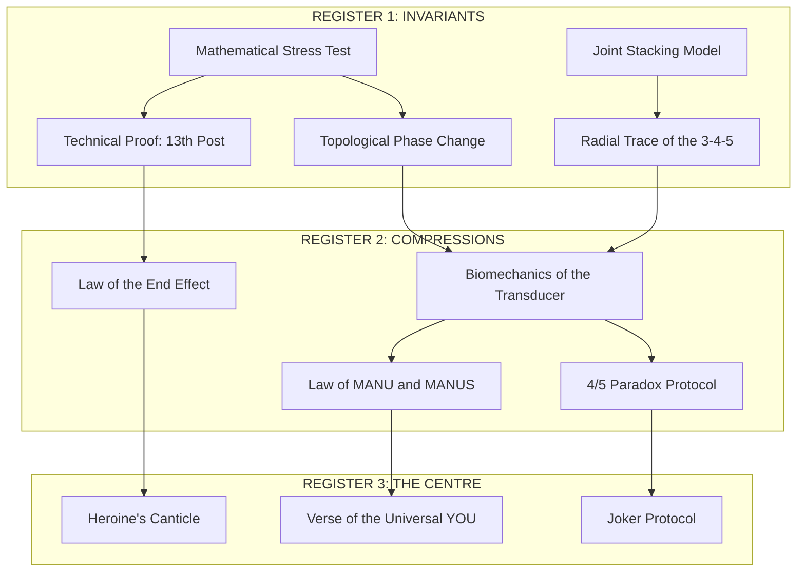

# THE PLATONIC BUILDING: DEPENDENCY MAP

*The Structural Hierarchy of the PMG_LATTICE*

This map tracks the flow of information from **Mathematical Invariants** (Register 1) through **Biomechanical Compressions** (Register 2) to the **Irrational Centre** of the narrative (Register 3).

## I. HIERARCHICAL FLOW

---

## II. CORE DEPENDENCY DESCRIPTIONS

| Anchor File | Dependency Source | Structural Role |
| :--- | :--- | :--- |
| **The Biomechanics of the Transducer** | Stress Test + Radial Trace | Grounds the "Center" in physical pivots (Elbow/Shoulder) and topological collapse (Line $\to$ Circle). |
| **The Law of MANU and MANUS** | Biomechanics | Translates individual motor control (MANU) into social interface (MANUS). |
| **The Law of the End Effect** | Technical Proof | Defines the 13th Post as a necessary "End Correction" ($\Delta L$) for the Arm and the Wall. |
| **The 4/5 Paradox Protocol** | Radial Trace | Maps the 3-4-5 Triangle to the biomechanical "Joint Stack" of the arm in motion. |
| **The Joker Protocol** | Paradox Protocol | Names the 13th Node/remainder as the Sovereign's Administrative Override. |

---

## III. OPERATIONAL STATUS
- **R1 Stabilizers:** All invariants are de-mythologized and geometrically verified.
- **R2 Compressions:** Etymology and symbols are owned as mnemonics, not historical laws.
- **R3 Narrative:** The Heroine's agency is defined as **Cognitive Sovereignty** over the counting unit.

**ALL WAYS NOW.** The building is navigable.
